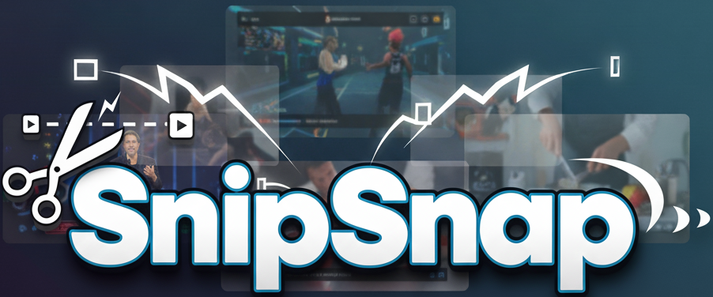
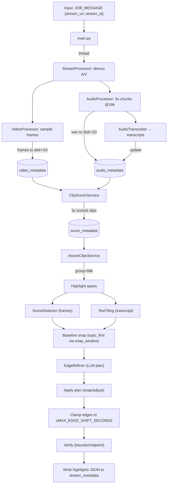

<p align="center">
  
</p>

A serverless system that accepts any `public video URL` and identifies and captures highlight worthy moments in the video. A lightweight React app lets you submit URLs and view highlights.

## Monorepo Layout

- `frontend/` — Vite + React UI (submit URL, dashboard, highlight player).
- `api_lambda/` — AWS Lambda handlers behind HTTP API Gateway (submit job, list streams, fetch highlights).
- `main.py` + `stream_processor/` + `audio_transcriber.py` + `clip_scorer_service.py` + `assort_clips_service.py` — AWS Batch container that runs the end‑to‑end pipeline.
- `repositories/` — Aurora access layer used by the Batch job.
- `serverless.yaml` — Infrastructure (VPC, Aurora Serverless v2, S3, CloudFront, AWS Batch, API Gateway + Lambdas).
- `deploy.sh` — One‑stop deployment for infra, container image, and frontend.
- `AGENTIC.md` — Details of the agentic refinement loop and knobs.

## Quick Start (Local)

- Requirements

  - Python 3.11, Node 18+, Docker, AWS CLI
  - `uv` for Python

- Batch pipeline (standalone)

  - `uv run sync` to install deps from `pyproject.toml`.
  - Set `JOB_MESSAGE` and run the entrypoint:
    ```bash
    export JOB_MESSAGE='{"stream_url":"https://example.com/video.mp4","stream_id":"demo-123"}'
    uv run main
    ```

- Local HTTP API

  - From repo root: `npm install` then `npm run offline` (Serverless Offline at http://localhost:3000).
  - Submit a URL:
    ```bash
    curl -sS -X POST http://localhost:3000/video-url \
      -H 'Content-Type: application/json' \
      -d '{"stream_url":"https://example.com/video.mp4"}'
    ```
  - List streams: `curl -sS 'http://localhost:3000/streams?page=1&limit=12'`
  - Fetch highlights: `curl -sS 'http://localhost:3000/highlights?stream_id=demo-123'`

- Frontend (development)
  - `cd frontend && npm install && npm run dev` (opens http://localhost:5173).
  - Create `frontend/.env.local`:
    ```env
    VITE_APP_NAME="Clip Highlights"
    VITE_API_BASE_URL=http://localhost:3000
    # When deployed, set to https://<CloudFrontDomain>/streams/
    VITE_ASSET_BASE_URL=http://localhost:3000/streams/
    ```

## End‑to‑End Flow



## Configuration

- Pipeline toggles (see `config.py`)

  - `AGENTIC_REFINEMENT_ENABLED` — skip/enable snapping + LLM refinement.
  - `MAX_EDGE_SHIFT_SECONDS`, `HIGHLIGHT_MIN_LEN`, `HIGHLIGHT_MAX_LEN`.
  - TextTiling: `TEXT_TILING_BLOCK`, `TEXT_TILING_STEP`, `TEXT_TILING_SMOOTH`, `TEXT_TILING_CUTOFF_STD`.

- Lambda/Batch environment (see `serverless.yaml`)
  - `SECRET_NAME`, `DB_URL`, `DB_NAME` — Aurora access.
  - `BATCH_JOB_QUEUE`, `BATCH_JOB_DEFINITION` — job submission.
  - `STREAM_METADATA_TABLE` — target table for job status/highlights.
  - `CDN_DOMAIN` — CloudFront domain for assets; consumed by the Batch job.
  - `FRONTEND_ORIGIN`, `ALLOWED_ORIGINS` — CORS controls.
  - `ACCEPT_STREAMS` — gate submissions (set `True` to accept new jobs).

## Deployment

`./deploy.sh` orchestrates everything. Defaults: stage `main`, region `us-east-1`.

- All components

  - `./deploy.sh`

- Only infrastructure (Serverless stack)

  - `./deploy.sh --infra-only`

- Only container image (build + push to ECR)

  - `./deploy.sh --image-only`

- Only frontend (build → upload to S3 → CloudFront invalidation)
  - `./deploy.sh --frontend`

## Agentic Refinement

See `AGENTIC.md` for the Observe → Plan → Act → Verify loop and safety guardrails.

## Note

The repository only streams 5 mins of a given video, to save costs, one can change it by configuring `MAX_STREAM_DURATION`
