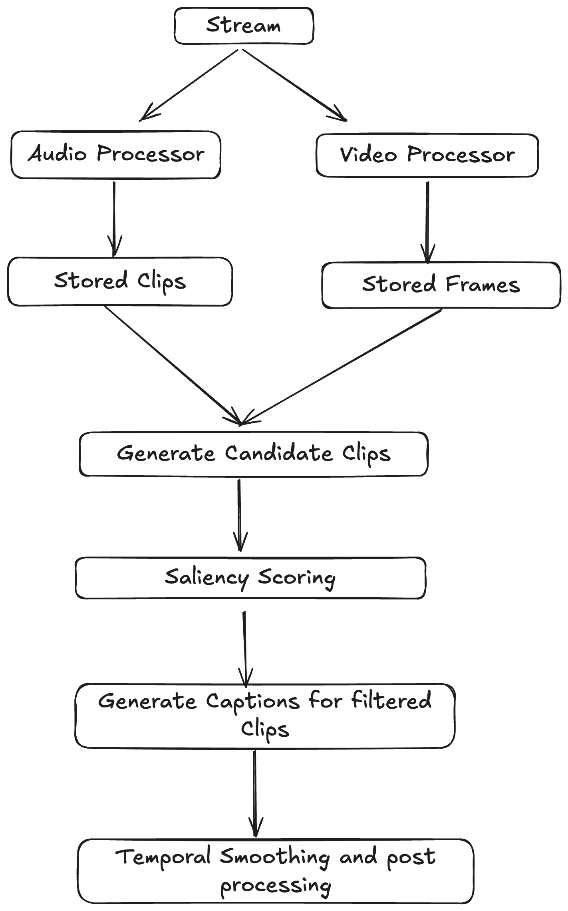

# Clip Highlights

## Setting Up

- `uv run sync` to download the requirements.
- `uv run main` to run the project.

> `[Stream Processor] Ending the stream, exiting.` After this log press Ctrl+C to stop the program.

## Work Flow



### Candidate Clips

    - Sampled frames from video in 5 sec interval
    - Audio for the same interval
    - Intervals will be like 0-5, 3-8, 6-11 etc.

### Saliency Scorer Example

```python
import cv2
import numpy as np
import torch
import librosa
from open_clip import create_model_and_transforms, get_tokenizer
from torchvision import transforms

class SaliencyScorer:
    def __init__(self, clip_model="ViT-B-32", device="cuda"):
        # ---- CLIP encoder ----
        self.model, _, self.preprocess = create_model_and_transforms(
            clip_model, pretrained="openai"
        )
        self.model.eval().to(device)
        self.device = device
        self.prev_gray = None
        self.prev_emb  = None

    # ---------- Optical Flow ----------
    def motion_score(self, frame_bgr):
        gray = cv2.cvtColor(frame_bgr, cv2.COLOR_BGR2GRAY)
        if self.prev_gray is None:
            self.prev_gray = gray
            return 0.0
        flow = cv2.calcOpticalFlowFarneback(
            self.prev_gray, gray,
            None, 0.5, 3, 15, 3, 5, 1.2, 0
        )
        mag = np.linalg.norm(flow, axis=2)
        self.prev_gray = gray
        return float(np.mean(mag))

    # ---------- Embedding Delta ----------
    @torch.no_grad()
    def embedding_delta(self, frame_bgr):
        img = cv2.cvtColor(frame_bgr, cv2.COLOR_BGR2RGB)
        pil_img = transforms.ToPILImage()(torch.from_numpy(img).permute(2,0,1))
        emb = self.model.encode_image(self.preprocess(pil_img).unsqueeze(0).to(self.device))
        emb = emb / emb.norm(dim=-1, keepdim=True)
        if self.prev_emb is None:
            self.prev_emb = emb
            return 0.0
        delta = 1 - (emb @ self.prev_emb.T).item()
        self.prev_emb = emb
        return float(delta)

    # ---------- Audio RMS ----------
    @staticmethod
    def audio_rms(y, sr, start_sec, end_sec):
        start = int(start_sec * sr)
        end   = int(end_sec   * sr)
        clip  = y[start:end]
        rms = librosa.feature.rms(y=clip)[0]
        return float(np.mean(rms))

    # ---------- Combined Score ----------
    def combined_score(self, frame_bgr, audio_y=None, sr=None,
                       start_sec=None, end_sec=None,
                       w_motion=0.4, w_embed=0.4, w_audio=0.2):
        m  = self.motion_score(frame_bgr)
        e  = self.embedding_delta(frame_bgr)
        a  = 0.0
        if audio_y is not None and sr is not None:
            a = self.audio_rms(audio_y, sr, start_sec, end_sec)
        return w_motion*m + w_embed*e + w_audio*a
```

### Post Processing

#### Temporal Smoothing & Peak Detection

    - Collect all highlight_scores aligned to clip start times.
    - Smooth with a Gaussian or median filter to reduce noise.
    - Mark peaks where score > threshold (e.g., 90th percentile).
    - Merge overlapping/adjacent peaks to form continuous highlight intervals.

#### Post Processing:

    - Speech Alignment
    - Context Addition
    - Scene Alignment using pyscenedetect
    - Ranking and Output

### Deploy
Running `./deploy.sh` updates infra by running serverless and updates ecr image and deploys aws batch
To only update ecr and aws batch do `./deploy.sh --image-only`
